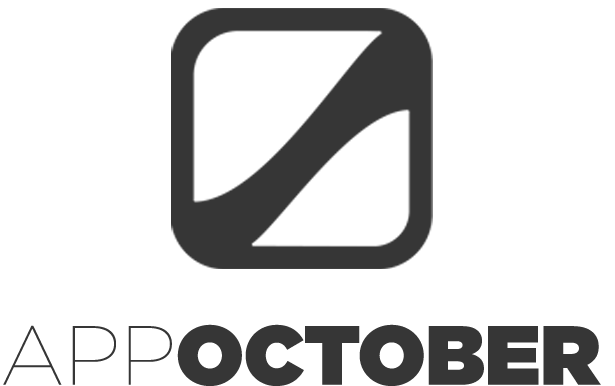
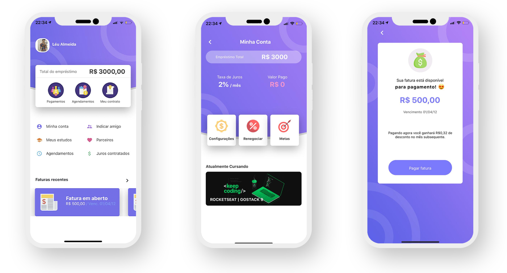

<p align="center">

</p>

# AppOctober | Dashboard para clientes
Este projeto nasceu de um desafio para uma onda de desenvolvimento React, na qual decidi transformá-lo em um aplicativo de código aberto para outros desenvolvedores usarem e melhorarem a interface e o próprio código.

<p align="center">

</p>

## Requisitos
- Node >= 10.16.3
- Yarn >= 1.19.1

### Rodando o projeto
Sem muitos segredos por aqui. Seguindo as instruções do challenge, a aplicação foi desenvolvida utilizando Expo (no branch 1.0.0 você pode rodar utilizando o React Native). Portanto, para iniciar a aplicação basta seguir os passos abaixo.

```js
// Clonando o projeto
$ git clone https://github.com/LeuAlmeida/app.october.git

// Acessando a pasta da aplicação
$ cd app.october

// Instalando as dependências
$ yarn

// Iniciando a aplicação no Expo
$ yarn start

```

<p align="center">
<a href="http://linkedin.com/in/leonardoalmeida99">Connect me in LinkedIn</a> | <a href="http://behance.net/almeida99">See my Behance</a> | <a href="https://leunardo.dev">Click here to go to my CV</a>
</p>
